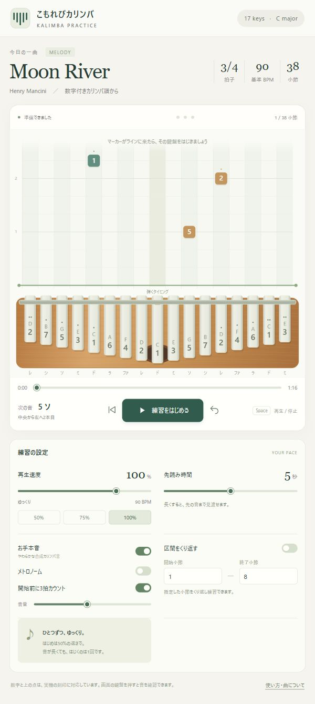
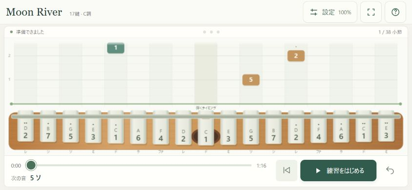

# こもれびカリンバ — 試作版

`カリンバを開く.cmd` または `index.html` をダブルクリックすると、既定のブラウザーで起動します。
Edge / Chrome を想定しています。
ネット接続・追加インストールは不要です。画面と音の確認にはPCの音量を上げてください。

GitHubから取得する場合は、リポジトリの **Code → Download ZIP** でダウンロードし、
ZIPを展開してから起動してください。HTML・JavaScript・CSSは同じフォルダーに置きます。

## スマートフォンで練習する

**横向きを基本にした画面に対応しました。** 17鍵・落下マーカー・再生操作が1画面に収まります。
速度・音・区間リピートは右上の「設定」から変更します。設定を開くと一時停止し、閉じた後は再生ボタンで再開します。
縦向きでも操作できますが、鍵盤を大きく見るには横向きをおすすめします。
画面の向きのロックを解除し、スマートフォンを横にしてください。
対応ブラウザーでは右上の四隅のアイコンから全画面表示にできます。

このPCから、同じWi-Fiに接続したスマートフォンへ配信できます。

1. PCで `スマホで開く.cmd` をダブルクリックします。
2. PCとスマートフォンを同じWi-Fiに接続します。
3. 起動したウィンドウに表示される `http://192.168.…:8765/` などのURLを、スマートフォンのSafari / Chromeで開きます。
4. 横向きにして「練習をはじめる」をタップします。

PCの配信ウィンドウは開いたままにしてください。終了は `Ctrl+C` またはウィンドウを閉じます。
`127.0.0.1` のURLはPC専用です。複数のIPアドレスが表示された場合は、PCのWi-FiのIPv4アドレスを使います。
初回にWindowsの通信許可が表示された場合、自宅のプライベートネットワークだけを許可してください。
開けないときは、同じWi-Fiか、端末間通信を禁止するゲストWi-Fiでないか、PCのファイアウォール設定を確認してください。
この方法はPython 3.9以降を使います（このPCでは3.11を確認済み）。スマートフォンへのインストールは不要です。

配信中は同じネットワーク上の端末からアプリを開けます。自宅など信頼できるネットワークで使ってください。
配信対象はアプリのHTML・CSS・JavaScriptだけです。楽譜画像、Git情報、その他のローカルファイルは配信しません。
GitHubはソースの保管場所です。PCを起動せず外出先から使う公開URLや、ホーム画面へのインストール機能はまだありません。

## 使い方

1. 実機を画面と同じ向きで持ちます。中央は「C / 1」です。
2. 「練習をはじめる」を押します。標準では3拍カウントしてから始まります。
3. マーカーの中央が緑色の水平ラインに到達したタイミングで、対応する鍵盤を1回はじきます。
4. 再生速度を25〜125%に変更できます。先読み時間は2〜8秒で独立して変更できます。
5. 開始・終了小節を入力して「区間をくり返す」をオンにすると、その範囲を反復します。

- Spaceキー：再生／一時停止（入力欄やボタンにフォーカスがないとき）
- 左のボタン：曲またはループ区間の先頭へ戻る
- 右のボタン：1小節戻る
- 横のバー：再生位置の移動
- 画面の鍵盤：クリック／タップで音を確認
- お手本音・メトロノーム・カウントインは個別に切り替え可能
- 別のタブに移ると自動で一時停止します
- 設定はブラウザー内に保存します。ブラウザーの制限により保存できない場合でも練習は可能です

## 内蔵曲

Moon River / Henry Mancini。ユーザー提供の「Kalimba Class」の数字付き五線譜を転記。
全38小節、3/4拍子、四分音符90 BPM、114拍（原速で76秒、開始カウントを除く）。
単音メロディー、C4〜D5。休符とタイを反映し、タイの続きでは弾き直しません。
区間開始がタイの途中の場合も、新しい発音は追加しません。
お手本音はWeb Audio APIで生成する合成音で、録音のカリンバ音ではありません。
譜面の目視転記なので、原譜との最終的な聴き合わせは今後の調整対象です。

この試作の曲データは今回の個人練習用です。公開・配布用の曲ライブラリには含めていません。

## 試作の範囲

17鍵の落下表示、内蔵曲、合成お手本音、メトロノーム、3拍カウント、速度変更、先読み時間、
一時停止、シーク、区間リピートに対応。
MIDI読み込み、実機の音声認識、採点、録音は未実装です。

## ファイル

- `index.html`：起動用
- `カリンバを開く.cmd`：Windows用の起動ショートカット
- `スマホで開く.cmd` / `serve.py`：同じWi-Fiのスマートフォンへ配信
- `style.css`：画面の見た目
- `music.js`：17鍵配列、曲データ、時間計算
- `app.js`：画面描画と音声・再生操作
- `layout.js`：短い横画面を含む17鍵の配置計算
- `test-music.cjs`：譜面の拍数、タイ、休符、時間計算の自動テスト
- `test-layout.cjs`：鍵盤・音名・マーカーの配置の自動テスト
- `test-server.py`：配信するファイルの制限・HTTP応答の自動テスト
- `preview.jpg`：アプリの画面
- `preview-mobile.jpg`：スマートフォン横画面の表示例

確認に使った楽譜画像はローカルに保管し、Gitの管理対象には含めていません。

開発用テスト：`node --test --test-isolation=none test-music.cjs test-layout.cjs` と `python test-server.py`

PCだけのプレビュー：`python serve.py`。別のポートを使う場合は `python serve.py --lan --port 8766`。

Web Audioの時計からマーカー位置を毎フレーム計算し、音は同じ時計に予約します。
外部ライブラリ、CDN、外部フォント、ネットワークへのファイル送信は使っていません。

## 確認状況（2026-10-05）

- 自動テスト8件：すべて成功。
- ローカルHTTPで実画面を操作し、再生・停止、速度変更、3小節目のみの反復、曲の終了、設定保存、使い方表示を確認。
- 1280pxと480pxの画面幅で表示を確認。480pxで横方向のはみ出しなし。
- アプリ内ブラウザーのポリシーがfile URLを禁止しているため、ファイルをダブルクリックする起動方法は自動操作では未検証。直接起動向けに相対パスの通常スクリプトだけで構成し、fetchやモジュール読み込みは使用していません。
- 実機を弾きながらの音量・音色・視認性と、スピーカー出力に対する体感の同期は、利用者による調整・確認が必要です。

### スマートフォン対応の確認（2026-10-08）

- JavaScriptの自動テスト9件、Pythonの配信テスト2件が成功。
- ブラウザーの表示領域を844×390、568×320、667×280の横向き、390×844の縦向き、1280×900のPCサイズに変更して確認。スマートフォン横画面は縦横のはみ出しなし。
- 設定の開閉、設定時の一時停止、速度変更、再生再開、シーク、ヘルプ、全画面表示と解除、PC表示への切り替えを確認。
- iPhone / Android実機、Safari固有の音声動作、実際のWi-Fi越しの接続は未検証。全画面機能はブラウザーが対応している場合のみ表示します。
